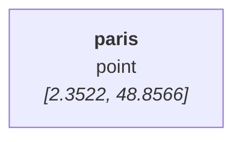

### ***JSON-NTV (named and typed value)   : a semantic format for interoperability***
*JSON-NTV is a universal representation format. It allows the sharing and conversion of any type of data (NTV format).*     
    
*The NTV format is part of the [Environmental Sensing Project](https://github.com/loco-philippe/Environmental-Sensing#readme)*

# Introduction
    
The semantic level of shared JSON (or CSV) data (e.g. Open Data) remains low, which makes automated reuse difficult.

JSON-NTV proposes to enrich it to obtain a real interoperable exchange format.    
  
## what is NTV structure ?

The NTV format consists of representing data by three attributes: a name, a type and a value. This representation is common in programming languages (for example a variable with Python typing is defined by `age: int = 25`), however the JSON format represents data with only a value or a key:value pair.
    
The JSON-NTV extension consists of including the type in the name to associate it with a value (for example `{'age:int': 25}` is the JSON representation of the NTV triplet ('age', 'int' , 25 ) ).
   
This approach makes it possible to reversibly represent any simple or complex data by a JSON structure (high interoperability).

## Examples
```python
In [1]: from shapely.geometry import Point
        from datetime import date

In [2]: Ntv.obj({"paris:point" : [2.3522, 48.8566] }).to_mermaid(disp=True)
Out[2]:
```

```python
In [3]: Ntv.obj({"paris:point" : [2.3522, 48.8566] }).to_mermaid(disp=True)
Out[3]:
```


> *For example, the location of Paris can be represented by:*
> - *a name: "Paris",*
> - *a type: the coordinates of a point according to the GeoJSON format,*
> - *a value: [ 2.3522, 48.8566]*

The easiest way to add this information into a JSON-value is to use a JSON-object with a single member using the syntax [JSON-ND](https://github.com/glenkleidon/JSON-ND) for the first term of the member and the JSON-value for the second term of the member.

> *For the example above, the JSON representation is:*    
> *```{ "paris:point" : [2.3522, 48.8566] }```*

With this approach, two NTV entities are defined:
- a primitive entity which is not composed of any other entity (NTV-single),
- a structured entity which is an ordered sequence of NTV entities (NTV-list).
      
as well as two JSON formats:
- simple format when the name and the type are not present (this is the usual case of CSV data),
- named format when the name or type is present (see example above for an NTV-single entity and below for a structured entity).

> *Example of an entity composed of two other entities:*
> - *```{ "cities::point": [[2.3522, 48.8566], [4.8357, 45.7640]] }``` for an unnamed NTV-list entity*
> - *```{ "cities::point": { "paris":[2.3522, 48.8566], "lyon":[4.8357, 45.7640] } }``` for a named NTV-list entity*
>
> *Note: This syntax can also be used for CSV file headers*

The type incorporates a notion of `namespaces` that can be nested.
> *For example, the type: "ns1.ns2.type" means that:*
> - *ns1. is a namespace defined in the global namespace,*
> - *ns2. is a namespace defined in the ns1 namespace.,*
> - *type is defined in the ns2 namespace.*    
    
This structuring of type makes it possible to reference any type of data that has a JSON representation and to consolidate all the shared data structures within the same tree of types.

## NTV uses

Several variations and use cases of the NTV format are defined:
- Tabular data exchange format (e.g. open-data)
- Compact, reversible and semantic pandas-JSON interface
- Comment and change management of JSON data
- visualization of JSON or NTV tree
- JSON data editor

## NTV and JSON

The flowchart below explain how to convert and exchange native entities through NTV and JSON format.


*Properties :*
- each NTV object has a unique JSON representation
- each JSON data corresponds to a unique NTV entity
- an NTV entity is a tree where each node is an NTV entity and each leaf an NTV-Single entity
- an NTV entity is a neutral representation (independent of a software or hardware platform)

### ***If you are interested challenge us !*** We will be very happy to show you the relevance of our approach

